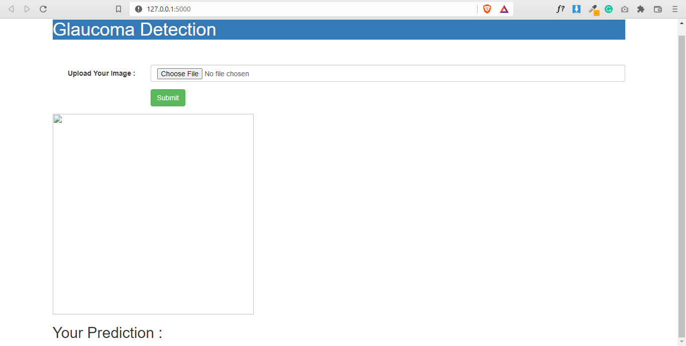

# Glaucoma-Detection

 ### 𝙲𝚘𝚗𝚝𝚎𝚡𝚝
 Glaucoma is a group of eye conditions that damage the optic nerve, the health of which is vital for good vision. 
 This damage is often caused by an abnormally high pressure in your eye.  
 Glaucoma is one of the leading causes of blindness for people over the age of 60.
 
 ### 𝙲𝚘𝚗𝚝𝚎𝚗𝚝
 The data set used contains images/oct scans of the eye. 
 Kaggle dataset link -> https://www.kaggle.com/datasets/sshikamaru/glaucoma-detection
 
 ### 𝙼𝚘𝚍𝚎𝚕 𝚂𝚙𝚎𝚌𝚒𝚏𝚒𝚌𝚜
 - the data set used is already divided into train and validation data / directories
 - used data augmentation to produce more images to train and validate our model
 - loss function : binary crossentropy
 - optimizer : RMSProp
 
 ### 𝙵𝚕𝚊𝚜𝚔 𝚆𝚎𝚋𝚙𝚊𝚐𝚎
 
 
 
